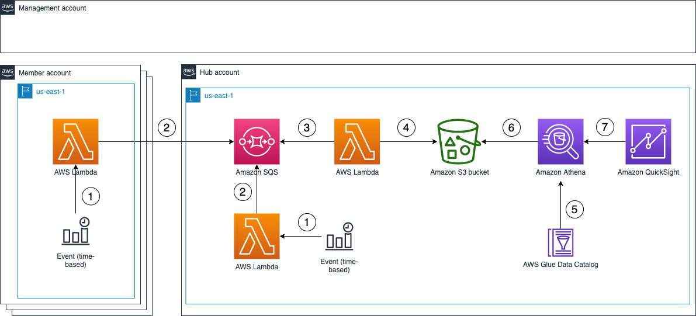

# Visualize AWS IAM Access Analyzer Policy Validation Findings
You will learn how to visualize AWS IAM Access Analyzer policy validation findings with AWS Analytics tools in an AWS multi-account setup. This repository is linked with the AWS blog post : `<<link_here>>`.
## Overview

### Components


This implementation is a serverless job triggered by Amazon EventBridge rules. It collects AWS IAM policies, validates the policies, stores the validation results in a S3 Bucket, uses Amazon Athena to query the findings results and Amazon QuickSight to visualize them.
1. The time-based rule is set to run daily. The rule triggers a Lambda function.
2. The first Lambda function lists [customer managed policies](https://docs.aws.amazon.com/IAM/latest/UserGuide/access_policies_managed-vs-inline.html#customer-managed-policies) and inline policies. For each IAM policy, it sends a message to a SQS queue. The message contains the IAM policy [Amazon Resource Name (ARN)](https://docs.aws.amazon.com/IAM/latest/UserGuide/reference_identifiers.html#identifiers-arns) and the policy document.
3. The second Lambda function polls the SQS queue for messages. For each message, the Lambda function extracts the policy document and validates it using IAM Access Analyzer `ValidatePolicy` API call.
4. The Lambda function stores evaluation results in the S3 results bucket.
5. The AWS Glue Table contains the schema for the IAM Access Analyzer findings. Amazon Athena natively uses the AWS Glue Data Catalog.
6. Amazon Athena is used to query the findings stored in the S3 bucket.
7. Amazon QuickSight uses Amazon Athena as a Data Source to visualize IAM Access Analyzer findings.
## Prerequisites
Before you begin:

0.  Install Git.
1.	Install the AWS CLI. For instructions, see Installing the AWS CLI in the [AWS Command Line Interface User Guide](https://docs.aws.amazon.com/cli/latest/userguide/getting-started-install.html).
2.	To deploy the implementation in a multi-account environment using AWS Organizations:
    * you must enable AWS Organizations [all features](https://docs.aws.amazon.com/organizations/latest/userguide/orgs_manage_org_support-all-features.html) and [trusted access to CloudFormation StackSets](https://docs.aws.amazon.com/AWSCloudFormation/latest/UserGuide/stacksets-orgs-enable-trusted-access.html).
    * you must have an [Amazon QuickSight Enterprise edition](https://docs.aws.amazon.com/quicksight/latest/user/upgrading-subscription.html). When you first sign up for Amazon QuickSight, you get a free trial subscription for four users for 30 days.
    
## Deployment
> _**Nota Bene**_
> You will deploy resources to the region you specify by the aws-region=<AWSRegion> parameter. For example, if you want to deploy the stack to us-east-1 you simply add aws-region=us-east-1.

1. Launch the hub stack in your AWS security tooling account: 
```bash
# Clone the repository
git clone https://github.com/aws-samples/visualize-iam-access-analyzer-policy-validation-findings

# Move to the repository's directory
cd visualize-iam-access-analyzer-policy-validation-findings

# Deploy the CloudFormation stack to your central security account (hub). For <AWSRegion> enter your region without quotes.
make deploy-hub aws-region=<AWSRegion>

# After the deployment is complete, make a note of the CloudFormation stack outputs SQSQueueUrl and KMSKeyArn
make describe-hub-outputs aws-region=<AWSRegion>
```
> _**Nota Bene**_
> If you want to deploy this implementation to a single AWS account, you should skip step #2.
2. Launch the spoke stack from your organization's management account.
```bash
# Create a CloudFormation StackSet to deploy the resources to all your member accounts. For <SQSQueueUrl> and <KMSKeyArn>, use the values from the `make describe-hub-outputs` output.
make deploy-members SQSQueueUrl=<SQSQueueUrl> KMSKeyArn=<KMSKeyArn> aws-region=<AWSRegion>
```
3. Deploy the QuickSight Dashboard in your AWS security tooling account.
    * Ensure that QuickSight is using the IAM role `aws-quicksight-service-role`.
        - In QuickSight, choose your account name in the navigation bar at top right and choose **Manage QuickSight**.
        - On the **Manage QuickSight** page that opens, choose **Security & Permissions** in the menu at left.
        - In the **Security & Permissions** page that opens, under **QuickSight access to AWS services**, choose **Manage**.
        - For **IAM role**, choose **Use an existing role**, and then do one of the following:
            * Choose the role `arn:aws:iam::<account-id>:role/service-role/aws-quicksight-service-role` from the list.
            * Or, if you don't see a list of existing IAM roles, you can enter the IAM ARN for the role in the following format: `arn:aws:iam::<account-id>:role/service-role/aws-quicksight-service-role`.
        - Choose Save.


    * Retrieve the QuickSight principals ARN.
    ```bash
    # <aws-region> your Quicksight main region, e.g. eu-west-1
    # <account-id> The ID of your account, e.g. 123456789012
    # <namespace-name> Quicksight namespace, e.g. default

    aws quicksight list-users --region <aws-region> --aws-account-id <account-id> --namespace default
    ```
    * Make a note of the user's ARN you want to grant permissions to. For example:  `arn:aws:quicksight:us-east-1:111122223333:user/default/User1`
    * To launch the QuickSight Dashboard deployment stack, run the following command.
    ```bash
    make deploy-dashboard-hub aws-region=<AWSRegion> quicksight-user-arn=<quicksight-user-arn>
    ```
## Cleanup
> _**Nota Bene**_
> 1. Ensure all created s3 buckets are empty before deleting the CloudFormation stack in your AWS accounts. The easiest way to delete everything (including old versioned objects) in a versioned bucket is to [empty the bucket via the console](https://docs.aws.amazon.com/AmazonS3/latest/userguide/empty-bucket.html).
> 2. Ensure Athena Workgroup is empty before deleting the CloudFormation stack in your AWS accounts: 
> `aws athena delete-work-group --work-group access-analyzer-findings-workgroup --recursive-delete-option`

To delete all deployed resources from the your AWS accounts, use the following commands.
1. Delete the CloudFormation stacks from your AWS accounts.
```bash
make delete-hub aws-region=<AWSRegion>
```
> _**Nota Bene**_
> If you deployed this implementation to a single AWS account, you should skip step #2.

2. Delete the CloudFormation StackSet instances and StackSets from your organization's member accounts.
```bash
make delete-stackset-instances aws-region=<AWSRegion>
# Wait for the operation to finish. You can check its progress on the AWS CloudFormation console.

make delete-stackset aws-region=<AWSRegion>
```

3. Delete the QuickSight Dashboard.
```bash
make delete-dashboard aws-region=<AWSRegion>
```

4. To cancel your QuickSight subscription and close the account, follow [Canceling your Amazon QuickSight subscription and closing the account](https://docs.aws.amazon.com/quicksight/latest/user/closing-account.html)
## Call to action
To dive deep on AWS IAM Access Analyzer, go to:
1. AWS IAM User Guide: [Using AWS IAM Access Analyzer](https://docs.aws.amazon.com/IAM/latest/UserGuide/what-is-access-analyzer.html).
2. [Access Analyzer policy check reference](https://docs.aws.amazon.com/IAM/latest/UserGuide/access-analyzer-reference-policy-checks.html)


## Security
See [CONTRIBUTING](CONTRIBUTING.md#security-issue-notifications) for more information.

## License
This library is licensed under the MIT-0 License. See the [LICENSE](LICENSE) file.
